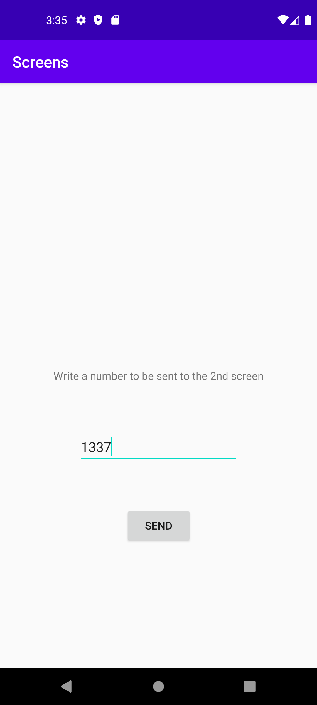
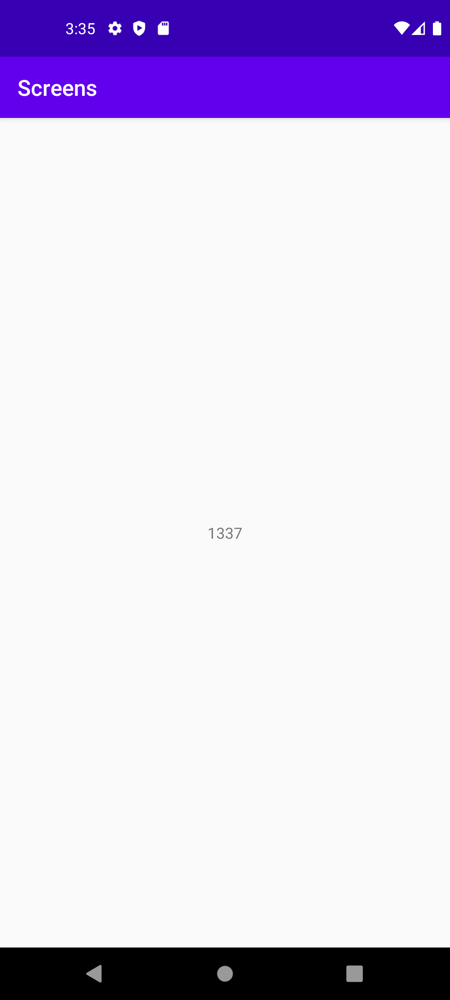

# Rapport

Jag gjorde en enkel main view med en text, en editview och en knapp där knappen skickar texten från editviewn till min basic view där texten visas i en textview.




när man klickar på knappen så skickas texten från editviewn till basic viewn med hjälp av en intent.

```java

button.setOnClickListener(v -> {
    Intent intent = new Intent(MainActivity.this, BasicActivity.class);
    intent.putExtra("message", editText.getText().toString());
    startActivity(intent);
});
```

I basic viewn så hämtar jag texten från intenten och sätter texten i textviewn.

```java
textView = findViewById(R.id.textView);
extras = getIntent().getExtras();
if (extras != null) {
    String message = extras.getString("message");
    textView.setText(message);
}
```
